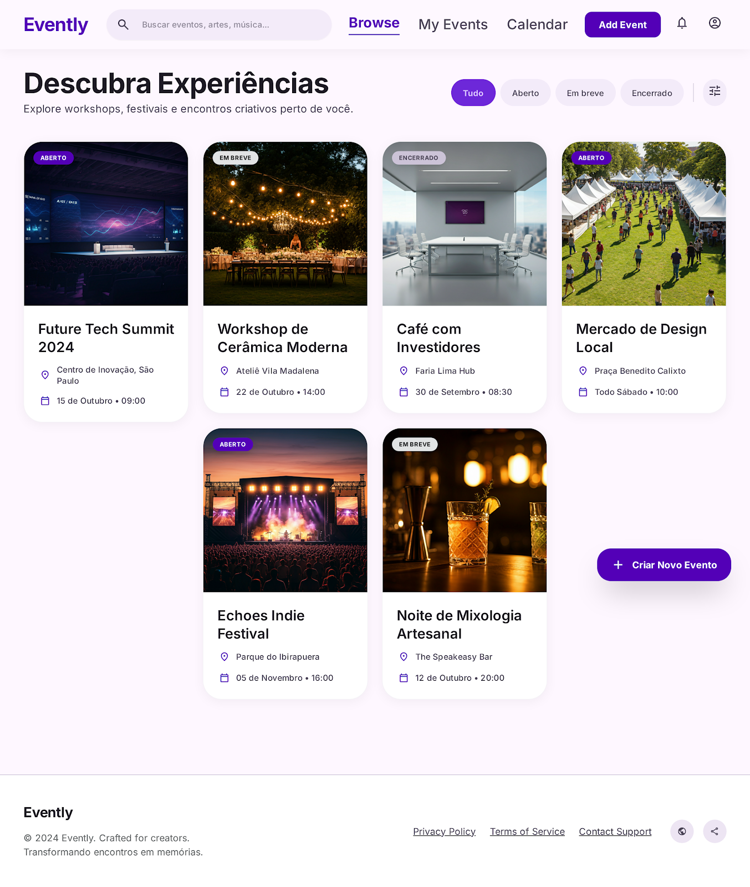

# gitparty

GitParty
Descrição do Projeto
O GitParty é uma aplicação web desenvolvida para gerenciamento de eventos.

O sistema permite cadastrar, visualizar, atualizar e excluir eventos de forma simples e organizada. Os eventos são exibidos em cards modernos com imagem, informações principais e acesso à tela de detalhes.

Além disso, o sistema possui atualização de eventos com histórico de imagens utilizadas anteriormente, trazendo uma experiência mais dinâmica e visual para o usuário.

O projeto foi desenvolvido utilizando HTML, CSS e JavaScript no front-end, juntamente com Node.js, Express, Prisma e MariaDB no back-end.

Prompt Utilizado
Quero criar uma aplicação web moderna para gerenciamento de eventos.
O sistema deve possuir uma interface bonita, organizada e responsiva, focada em facilitar a visualização e administração de eventos.

A página inicial deve listar todos os eventos cadastrados em formato de cards modernos com imagem.
Cada card deve conter:

imagem do evento
título
local
data do evento
status do evento

Ao clicar em um card, o usuário deve ser direcionado para uma tela de detalhes do evento.

Também deve existir um botão de “Adicionar Evento” em destaque na página principal.

Funcionalidades principais
Página inicial
Listagem de eventos em cards
Cards com hover suave
Botão para adicionar evento
Layout moderno e responsivo
Barra de pesquisa opcional
Possível filtro por status do evento

Cadastro de evento

O formulário de cadastro deve conter:

título do evento
descrição
data do evento
local
capacidade máxima
upload de imagem
status do evento

Botões:
salvar
cancelar

Tela de detalhes do evento

Ao abrir um evento, exibir:

imagem grande do evento
título
descrição completa
data
local
capacidade máxima
status do evento
quantidade de inscritos

Também deve conter:

botão de atualizar evento
ícone de lixeira para excluir evento
confirmação antes de excluir

Quero uma lixeira moderna e minimalista no canto superior da tela de detalhes.

Tela de atualização
formulário preenchido automaticamente
salvar alterações
cancelar edição

Estilo e design

Quero um design moderno, clean e profissional.

Características:

cards arredondados
sombras suaves
animações leves
aparência elegante
interface intuitiva
visual semelhante a aplicações modernas

Paleta de cores
Roxo como cor principal
Branco e cinza claro no fundo
Vermelho apenas para ações de exclusão
Tons suaves e modernos

Fontes
Poppins ou Inter

Público-alvo

O sistema é voltado para estudantes, organizadores de eventos, empresas e usuários que desejam visualizar e administrar eventos de forma prática e organizada.

## Página Inicial

## Página atualizar evento

